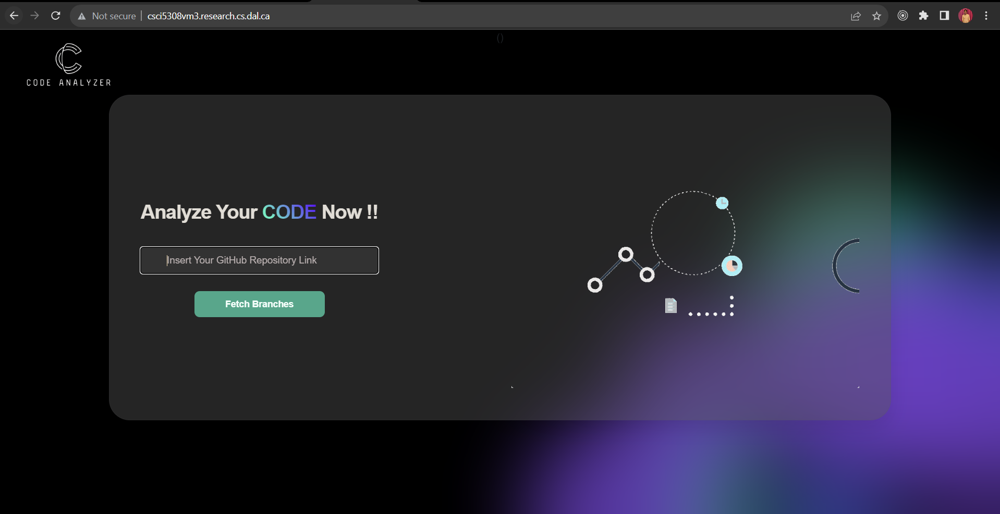

# Code Quality Report Analyzer

Deployed Version: http://csci5308vm3.research.cs.dal.ca/


# Table of content:
### 1. [Dependencies](#dependencies)
### 2. [Build and Deployment Instructions](#build-and-deployment-instructions)
### 3. [Usage Scenario](#usage-scenario)
### 4. [Refactored Smells](#refactored-smells)
### 5. [Test Coverage](#test-coverage)
### 6. [Pipeline](#pipeline)


# Dependencies

## Git

    sudo apt-get update 
    sudo apt-get install git
    
## NodeJs

   Refer: https://nodejs.org/en/download, to install depending upon your OS flavour. Below is for Ubuntu.

    sudo apt-get install nodejs

## Serve
This will be used to run the production build of react app

     sudo npm install -g serve
## Maven
For creating the jar file for Spring boot app.

    sudo apt update
    sudo apt install maven
    mvn -v
## JDK 17
For running the jar file for Spring boot app.

    sudo apt install openjdk-17-jdk
## Python

   Refer: https://www.python.org/downloads/, to install depending upon your OS flavour. Below is for Ubuntu.

    sudo apt-get install python3.12
    
## Docker
Below are the instructions for Ubuntu. For other flavours of OS please check: https://docs.docker.com/get-docker/
1.  Set up Docker's  `apt`  repository.
    
    ```bash
    # Add Docker's official GPG key:
    sudo apt-get update
    sudo apt-get install ca-certificates curl gnupg
    sudo install -m 0755 -d /etc/apt/keyrings
    curl -fsSL https://download.docker.com/linux/ubuntu/gpg | sudo gpg --dearmor -o /etc/apt/keyrings/docker.gpg
    sudo chmod a+r /etc/apt/keyrings/docker.gpg
    
    # Add the repository to Apt sources:
    echo \
      "deb [arch=$(dpkg --print-architecture) signed-by=/etc/apt/keyrings/docker.gpg] https://download.docker.com/linux/ubuntu \
      $(. /etc/os-release && echo "$VERSION_CODENAME") stable" | \
      sudo tee /etc/apt/sources.list.d/docker.list > /dev/null
    sudo apt-get update
    ```
    
2.  Install the Docker packages.

    ```sudo apt-get install docker-ce docker-ce-cli containerd.io docker-buildx-plugin docker-compose-plugin```
    

3. Verify that the Docker Engine installation is successful by running the  `hello-world`  image.

	```sudo docker run hello-world```

Reference: https://docs.docker.com/engine/install/ubuntu/#install-using-the-repository

## Other Dependencies
[React Frontend Dependencies](code-quality-analyzer-frontend/package.json)

[Spring Boot Backend Dependencies](code-quality-analyzer-backend/pom.xml)

[Django Backend Dependencies](code_quality_analyzer_analysis/requirements.txt)

For code smell analysis: 
DesigniteJava Enterprise. Version 2.4.3.0 - https://www.designite-tools.com/


# Build and Deployment Instructions

There are 3 parts of this system and all of them need to be built and deployed, before the system can work end-to-end. (React, Spring Boot and Django app)

## Pre-req: clone the repository

    git clone https://git.cs.dal.ca/courses/2023-fall/csci-5308/Group03
    cd Group03
If prompted for credentials, please enter your gitlab username and password.

## Frontend - React

Go to the frontend folder before starting build and deploy instructions. Run the below command from the root directory of the cloned repository.

    cd code-quality-analyzer-frontend

### Build
#### Docker Build
To create a docker image for the react app run the docker build command as shown below:

    docker build -t frontend-react-app .

#### Normal Build
Step-1: Install Dependencies using npm install:

    npm install

Step-2: Run the below command to create production-ready build:

    npm run build

This builds the app for production to the `build` folder.  
It correctly bundles React in production mode and optimizes the build for the best performance.

The build is minified and the filenames include the hashes. (Reference: https://create-react-app.dev/docs/getting-started#npm-run-build-or-yarn-build)

### Run/Deploy
#### with Docker

    docker run -d -p 80:3000 --restart=always --name frontend-container frontend-react-app
#### without Docker
To run/deploy the frontend app, run the following command:

    serve -s build -p 80
This will use the production build that we created in the previous step.

The frontend can be accessed using: http://localhost:80 now.

## Backend 1 - Spring Boot

> Note: Dockerized version of Spring Boot app is not here supported due the node-locked enterprise key of DesigniteJava.

Go to the spring boot folder before starting build and deploy instructions. Run the below command from the root directory of the cloned repository.

    cd code-quality-analyzer-backend

### Build
Run the below command to create a jar file:

    mvn package

This will create a `code-quality-analyzer-backend-0.0.1-SNAPSHOT.jar` file in the folder `./code-quality-analyzer-backend/target/`

### Run/Deploy

To run/deploy the spring boot app locally, run the following command:

    java -cp app.jar:"./lib/DesigniteJava.jar" org.springframework.boot.loader.JarLauncher

There is a DesigniteJava.jar dependency which needs to be mentioned while running our spring boot application. This type of set-up is needed due to the node-lock premium key of DesigniteJava Enterprise tool. Make sure to activate the DesigniteJava tool using the command:

    java -jar DesigniteJava.jar -r <lic_key>

The Spring Boot app can be accessed using: http://localhost:8080 now.

## Backend 2 - Django

Go to the django folder before starting build and deploy instructions. Run the below command from the root directory of the cloned repository.

    cd code_quality_analyzer_analysis

#### Docker Build

    docker build -t backend-django-app .

#### Normal Build

We will just install the python modules required for this Django application using the below command. We don't have any specific command to create a build for Django apps.

    pip install -r requirements.txt

### Run/Deploy

#### with docker
Here, the `/home/adityapurohit27/Group03/code-quality-analyzer-backend/target` will change as per your own cloned repository path.

    docker run -d -p 8000:8000 --restart=always -v /home/adityapurohit27/Group03/code-quality-analyzer-backend/target:/home/adityapurohit27/Group03/code-quality-analyzer-backend/target --name backend-django-container backend-django-app

#### without docker

To run/deploy the Django app locally, run the following command:

    python manage.py runserver

The Django app can be accessed using: http://localhost:8000 now.

> Note: If facing connectivity issues between these 3 apps. Modify the below 3 sections.
> 
> React app: `.env.production` file REACT_APP_BACKEND_URL=[give valid spring boot app URL]
> 
> Spring Boot app: `application.properties` file analysis.service.base.url=[give valid django app URL]
> 
> Django app: `settings.py` file ALLOWED_HOSTS = ["csci5308vm3.research.cs.dal.ca","localhost", (add your host)]

# Usage Scenario
### Introduction
The Code Quality Report Analyzer is a web-based application for assessing and visualizing types of smells in a git repository. The main features are as follows:
1. **One commit analysis**: Analyze smells for user selected one commit and branch. Display analysis in form of pie charts and bar charts​

2. **Trend analysis**: Compare code smell analysis of last few commits and display the trend of changes in form of line charts along with stacked bar charts.​

3. **Hotspot analysis**: Analyze and show top problematic areas of repository code.​

### Landing Page
URL: http://csci5308vm3.research.cs.dal.ca/
Once the user has landed on the website, user will be prompted to enter the Github repository link as shown below:



After the user has entered the Github repository and clicked on "Fetch Branches" button, dropdown with list of branches and radio buttons will appear, where option for changing branches and selecting from three different options, i.e. **One-Commit**, **Trend Analysis** and **Hotspot Analysis** will be available as shown below:


One-Commit Selection:


Trend Analysis Selection:


Hotspot Analysis Selection:


Once selecting the desired branch, analysis then clicking on "Execute" button, it will redirect to the specified dashboard page. For example, if user selects One-Commit option, the user will be redirected to the OneCommit Dashboard page once the data is loaded.

### One-Commit Analysis:

Welcome to the One Commit Analysis Dashboard! This dashboard provides valuable insights into your project's latest commit in the form of "Pie" and "Bar" charts.

There are several types of Smells being displayed in the dashboard like ```Architecture Smells```, ```Design Smells```, ```Implementation Smells```, ```Test Smells``` and ```Testability Smells```, along with their "entities".

#### Dropdowns
The One Commit Analysis Dashboard offers two dropdowns for refining your analysis:
**Branch**: Select the branch you want to analyze from the available options.
**Commits**: Choose the specific commit you are interested in.

After selecting your desired branch and commit range, click the ```Update Analysis``` button to refresh the charts. This dynamic feature ensures that the Pie and Bar charts always reflect the most up-to-date information based on your selected parameters.


### Trend Analysis:

This dashboard provides insightful visualizations to help you understand the distribution of smells, the relationship with commits, and the overall health of your codebase.

#### Features:

##### Branch Dropdown
**Branch**: Select the branch you want to analyze from the available options. This allows you to focus on a specific branch's trends and code smells.
##### Stacked Bar Chart
The main visualization in this dashboard is the stacked bar chart. Each bar represents an individual smell, and the height of the bars indicates the total number of smells. Smells are color-coded for easy identification.

**Line Chart**
Above each bar in the stacked bar chart, there is a connected line chart that shows the total number of smells over time. This provides an additional layer of insight into the historical progression of smells.

**Additional Dropdowns**
Number of Commits Dropdown - Choose the scope of your analysis using the "Number of Commits" dropdown

**Full Repository**: Analyze the entire repository for the selected branch.
**Commit Changes**: Focus the analysis on commits made within the specified range.
**Smell Density**: Explore the density of smells relative to the number of commits.

**User Specific Dropdown**
Select a user from the dropdown to view trends specific to that user within the repository. This is particularly useful for understanding individual contributions to code smells.


When scrolled down the page, there will be chart present for individual smells as shown below:


### Hotspot Analysis:

Hotspot Analysis allows you to identify classes and methods with most smells in your project, which helps you prioritize what to refactor first.

#### Features:

**Branch Dropdown**

**Branch**: Select the branch you want to analyze from the available options. Focus your hotspot analysis on a specific branch to understand code quality variations.

**Stacked Bar Chart**
The main visualization in this dashboard is the stacked bar chart, which represents individual smells within your codebase. Each bar showcases a specific type of smell, and the total number of smells is displayed at the top of each bar. The connected line chart above the bars illustrates the historical progression of total smells.

**Top Classes List Dropdown**
Choose a specific option from the "Top Classes List" dropdown to dynamically update the chart with data related to the selected class. This allows you to pinpoint and analyze the smells within specific classes, helping you focus your efforts on critical areas.


**Top Methods List Dropdown**
Similar to the "Top Classes List" dropdown, the "Top Methods List" dropdown enables you to select a specific method for detailed analysis. This feature is particularly useful for understanding code smells at a granular level within your methods.


# Refactored Smells

### Spring Boot:

Before Refactoring: https://git.cs.dal.ca/courses/2023-fall/csci-5308/Group03/-/commit/b5f7526d990476a2eb66a5fe423ae2e52717a412

After Refactoring: https://git.cs.dal.ca/courses/2023-fall/csci-5308/Group03/-/commit/f85b977b9fe5be1a37b64393cdb3efaaf18ff138

All the true positive smells are resolved, others are justified in the csv itself(readme-files/CodeSmells/Spring Boot/f85b977b9fe5be1a37b64393cdb3efaaf18ff138_after) in comments column.

The after & before refactoring version of CSVs are present here in this repo: readme-files/CodeSmells/Spring Boot

### Django:

All the true positive pylint issues are refactored.

Before Refactoring: https://git.cs.dal.ca/courses/2023-fall/csci-5308/Group03/-/jobs/1481262/artifacts/browse for commit https://git.cs.dal.ca/courses/2023-fall/csci-5308/Group03/-/commit/7fc402254cb97245622b8f6d09ef1835e999e014

After Refactoring: https://git.cs.dal.ca/courses/2023-fall/csci-5308/Group03/-/jobs/1491127/artifacts/browse for commit https://git.cs.dal.ca/courses/2023-fall/csci-5308/Group03/-/commit/de9fa19bcc2dab1dcb776060b00808864aca183b

# Test Coverage

### Spring Boot - 95% Line Coverage.

commit id - https://git.cs.dal.ca/courses/2023-fall/csci-5308/Group03/-/commit/f85b977b9fe5be1a37b64393cdb3efaaf18ff138


### Django - 98% Line Coverage.

commit id - https://git.cs.dal.ca/courses/2023-fall/csci-5308/Group03/-/commit/f447bc8a8f1f37a3e3ea605d98bcc3460ca69a65


# Pipeline
Build & code quality stage is added for Spring Boot, Django and React.

Test stage is added for Spring Boot and Django only.


Deployment will only happen for master and develop branch commits/MRs.
